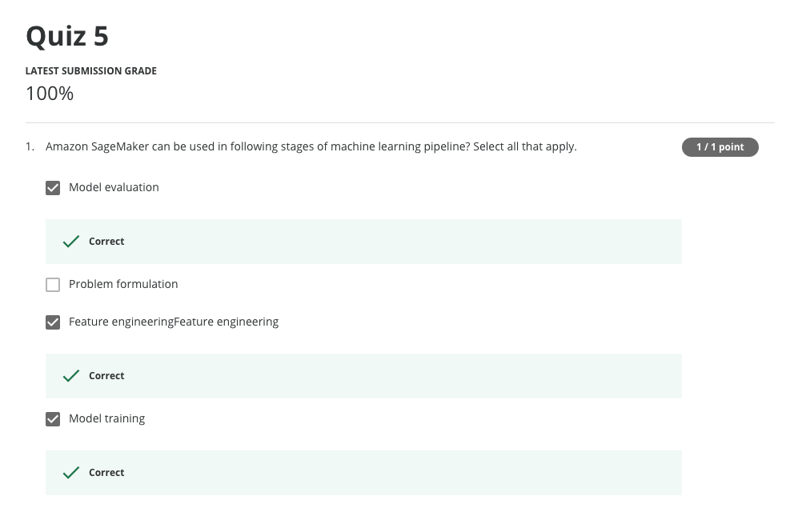

# Week5: Introduction to Amazon SageMaker
- Introduction to Amazon SageMaker
- Introduction to Amazon SageMaker GroundTruth
- Introduction to Amazon SageMaker Neo
- Automatic model tuning using Amazon SageMaker
- Quiz 5
- Amazon Sagemaker: Object Detection on Images labeled with Ground Truth
- Quiz 6
- Build a text classification model with Glue and Sagemaker
- Quiz 7

# Quiz 5

